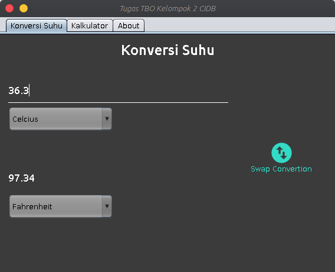
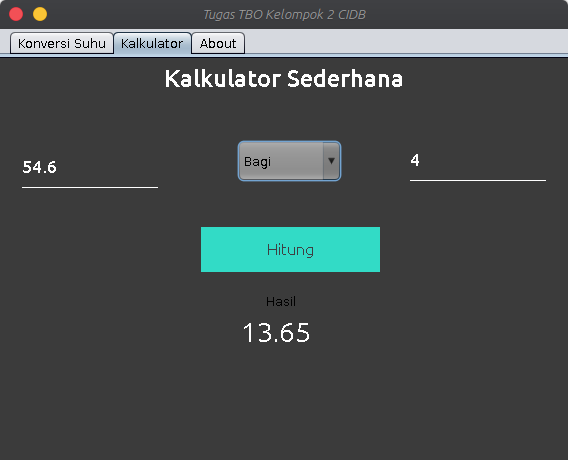

# Konverter Suhu & Kalkulator 2 Angka
### Kelompok 2
  * Andri Ilham       (17 111 322)
  * Hesti Sugesti     (17 111 329)
  * Siti Muayanah     (17 111 159)

Konverter Suhu dan Kalkulator sederhana 2 angka. Project ini untuk memenuhi tugas Mata Kuliah Pemrograman Berbasis Objek 2 semester 6.

## Konverter Suhu

Terdiri dari 4 satuan suhu, yakni:
  * Celcius
  * Fahrenheit
  * Kelvin
  * Reamur
Anda dapat melihat rumus konversinya di [sini](https://rumusrumus.com/rumus-konversi-suhu/)

## Kalkulator Sederhana 2 Angka 

Sesuai namanya, kalkulator sederhana ini hanya memiliki 2 buah inputan yang kemudian untuk operasi aritmatika nya dipilih melalui pilihan *dropdown*. Untuk melihat hasil dari perhitungan ini anda dapat memencet tombol Hitung kemudian hasil perhitungannya akan muncul dibawahnya.
